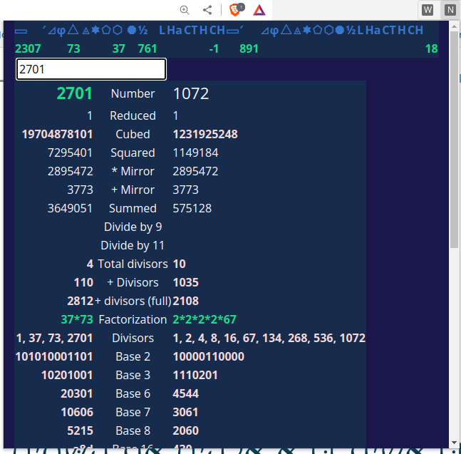

# number-cruncher

Simple tool to analyze numbers and show their properties.

There are no buttons, just begin typing a number in the top input field to start the magic.

Current version supports up to the number 39999 to avoid device lockups.

Use the link below to see the code in action.

https://htmlpreview.github.io/?https://github.com/RealHenkDenkt/number-cruncher/blob/main/index.html

### Chrome extension (Experimental)

I've added a manifest and index file so the project can be used as a Chrome extension. Clone or unzip the project 
to a folder, go to extensions in Chrome, enable developer mode and click 'load unpacked'. Select the folder 
where you unpacked the project.

